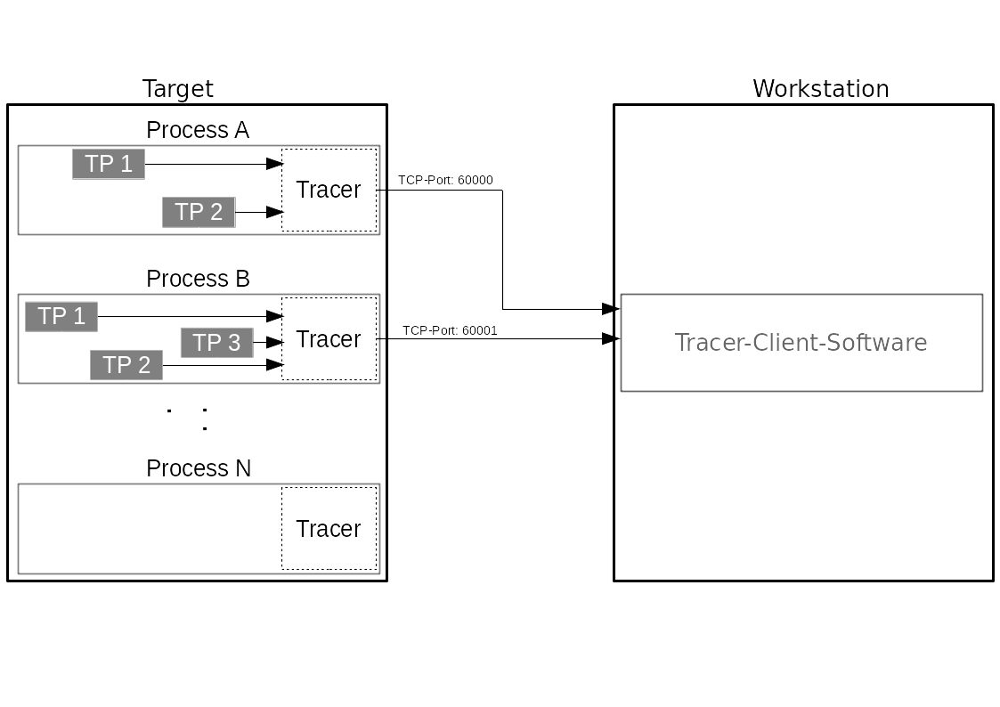
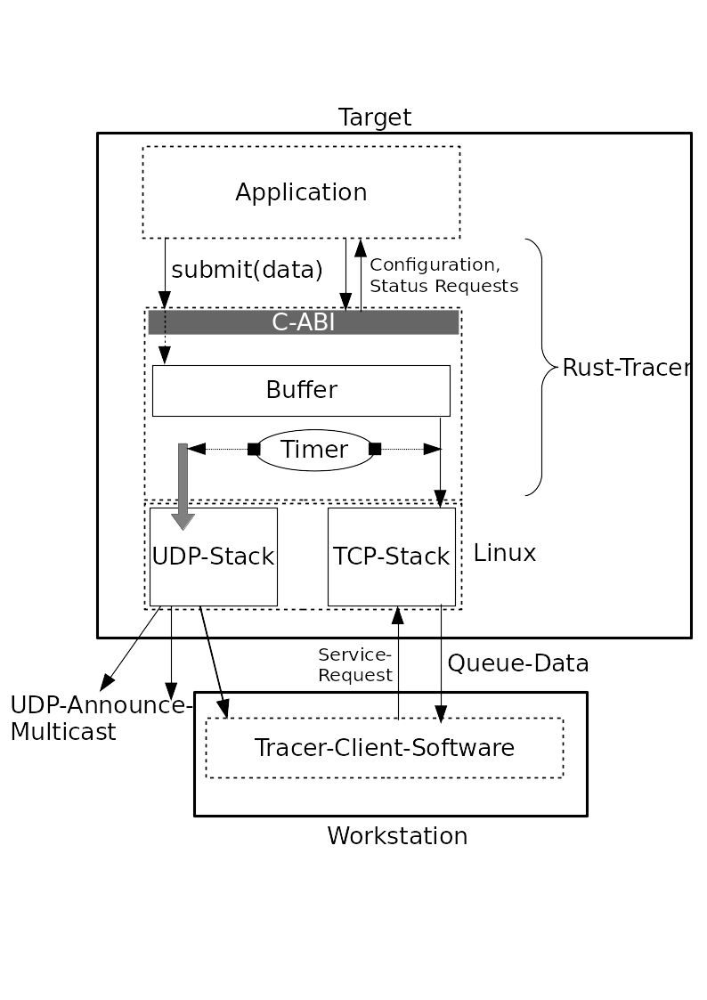

# Tracy

A Rust Tracing Library with binary C calling interface (FFI).



## License

This Source Code Form is subject to the terms of the Mozilla Public
License, v. 2.0. If a copy of the MPL was not distributed with this
file, You can obtain one at https://mozilla.org/MPL/2.0/.

## Usecase

The intended usecase is to transmit status messages from one device to another
device in the same network. Payloads are intended to be short status messages
and similar. The maximum data size per transmit is limited, as described in
`tracy.h`.

Targeted usergroups might be developers who want to trace applications on
embedded devices. In this case the developer's workstation,
located near the device, can trace data from it using the corresponding
client-software.

## Features

- Written in Rust - with Security and Safety in mind
- Call- and useable from a variety of programming languages like C, C++ and Rust
  without problems - useable from Go, Java, C#, Python and other languages as
  well (FFI)
- No central logging daemon required, each application, task or process operates
  independently. This makes integration easy and reduces conflicts with security
  mechanisms like SELinux or systems where no IPC system is deployed or not fast
  enough to transfer tracing data at a high rate.
- For security mechanisms: a unpriviliged TCP/UDP port per application is
  required, thats all.
- Easy integration: link to libtracy, call `tracy_init(...)` - thats all!
- Discovery mechanism over UDP mulitcasts to bundle independend tracer sources
  (tasks) to one stream
- Lightweight, everything is build with performance and overhead in mind
- Not blocking by design. A trace call will lead to a TCP write call, which may
  block the caller. To address this, tracy spawns a thread. The work thread
  works independently of the caller thread.
- Easy to remove in case of release and debug software versions: A phantom
  header is provided, which replaces all tracy-calls with empty void calls, which
  may be removed by the compiler.
- Linux only
- IPv4/IPv6 support

Tracy allows you to register tracepoints. Tracepoints are intended to provide a
point to submit related data to; you might for example set your tracepoints to
"kernel-messages", "thermal-sensor-1" etc.

Tracy announces itself via UDP multicasts, containing as a payload the names of
the device and of the application which started the tracer, an announce
sequence number and a TCP-Port-Number to connect to, to activate tracing
services and receive data. The matching part of the tracer, the
client-program, subscribes to these multicasts and either automatically
connects to the announced device, or offers the user to choose a device from a
list.

Once a client has connected, Tracy will stop announcing via UDP. The tracer does
not accept more than one client per application. Clients can activate tracepoints,
but only if a tracepoint has been registered previously. Only after this
activation, the submit-function will accept and copy data from the application
and the tracer will automatically transmit the data collected from the app
several times per second.

If a client disconnects, all tracepoints are set to disabled, the tracer will
not copy data from the application anymore and will start to announce its
presence via UDP again.

When a client is disconnected and has enabled the relevant tracepoint, Tracy
accepts data from the calling application. It buffers the data and sends it to the
client when one of the following events occur (depending on which comes first):

1. The buffer occupancy reaches a certain limit
2. An amount of time since inserting the first element in the buffer has passed.

This concept makes sure that small payloads don't immediately invoke a syscall
to write to the socket, and data still arrives several times per second.

Buffer sizes are defined in the Rust code and can only be changed there.

The picture shows Tracy's position in the radio and how the payload flow to the
client and announcing works.



## Threads

Always keep in mind that for each time calling tracy\_init one new thread gets
spawned.

> It's highly recommended that you only make one call to tracy\_init per
application, as there's no advantage in using several tracer threads.


## Preparing Rust Toolchain for Tracy

### Debian Packages

`apt install build-essential`

#### For aarch64 (ARM 64)

`apt install gcc-7-aarch64-linux-gnu`

## Building

This section describes how you might build the tracer directly via cargo, the
rust crate- and compiler-manager.

### For your host

`cargo build --release`

### For aarch64

`cargo build --target=aarch64-unknown-linux-gnu --offline --release`

### For ARM

`cargo build --target=armv7-unkown-linux-gnueabihf --offline --release`

### Output

A static and a dynamic library will be built.
It is stored in `tracy/target/PLATFORM`, or, in case of compilation for your
host, in `tracy/release`


## C API

**See tracy.h for extensive API description. See /examples for commented usage examples.**

All interface functions check if you pass them NULL-pointers or parameters which
don't make sense (such as a length of 0 or a length longer than the maximum
lengths defined in the header), but just like C-Functions they can not check if
you hand them invalid references or length-parameters violating string-boundaries.
*Handing over invalid references or data lengths will lead to crashes with high
probability*

None of these interface functions will ever change the data referenced by
pointers you hand over, such as your strings. The functions will always make their
own copies to operate on.

Only `void *tracer` might get changed by the interface functions, and only the
interface functions must change this pointer. Never access this pointer
any other way then with the functions described below; except when setting it
to NULL after having called `tracy_finit`!

Check out the header to see the exact definitions of allowed maximum message-
and string lengths.

### Strings

All Strings you pass to the Interface Functions have to be valid 7-Bit-ASCII,
only. Shorter than the maximum length defined in the header and *should* be all
lowercase. Whenever you pass uppercase strings, the functions local copy will
be converted to all loweracase. If you pass strings longer than permitted,
their local copy will get truncated. If you pass a String containing a
non-ascii character, the function will return false, error or execute an early
return – see below and header file for exact description.

Payloads for functions of the submit function are treated as bytes and therefore
may contain any character.

### Initialization

Init the tracer, this SHOULD be done onces per process.

```c
/* On success, returns an opaque pointer to a Rust-Tracer-Handler struct,
 * returns NULL on failure. */
void* tracy_init(const char *hostname,
                  const char *process_name,
                  unsigned buffer_flush_interval,
                  unsigned announce_interval,
                  const char *announce_iface,
                  const char *announce_mcast_addr,
                  int flags);
```

After this function returns, a new thread has been spawned, announcing your
hostname and process-name via UDP-Multicasts.

The opaque pointer returned by `tracy_init` contains Rust-datatypes necessary
for communicating with the spawned thread and checking various other things.
Only the interface functions described bellow are allowed to dereference this
pointer. Never do anything with it besides passing it to an interface function
described in the header or setting it to NULL *after* handing it to
`tracy_finit`.

The function will ignore your call if you set the buffer\_flush\_interval to 0
or set hostname or process\_name to NULL. If you don't specify an announce
*interface* via the address `X.X.X.X` (IPv4) or
`X:X:X:X:X:X%interfacename` for IPv6, the tracer will not announce. If you
don't specify a target UDP announce (multicast) address, the tracer will not
announce itself. It is highly recommended to use one of the default announce
addresses specified in the header.

`int flags` is currently unused, unchecked and reserved for later extensions.
You may set it to 0.

### Registering new tracepoints

Register tracepoints. It is required to register tracepoints before you can
submit data to them. This cannot be done automatically in `tracy_submit`,
because the application may generate tracepoints dynamically - this library
cannot guess dynamic data.  To register tracepoints the following api must be
used:

```c
/* Returns 0 on success, and a negative number on failure. */
int tracy_register(void *tracer, const char *tracepoint_name);
```

On success this function returns 0, in failure a number smaller than 0, see
concrete error definition in header file.

The function will reject tracepoints which are not valid ASCII and will
trunacate strings which are longer than the defined maximum length in the
header file (currently 32 chars)

This function can (will) be used multiple times, e.g.

```c
tracy_register(tracer, "network-pcap-tracer-eth0-in");
tracy_register(tracer, "network-pcap-tracer-eth0-out");
tracy_register(tracer, "tcp-state-machine-state-transitions"); /* Will get truncated */
```
Of course, you can also call the function in a loop iterating over tracepoints
in an array etc.

If you try to register a tracepoint which has already been registered for this
tracer-handler, the function will ignore your request and return an error.

Clients can get a list of registered tracepoints. Tracepoints can only be
enabled by the client. Per default all tracepoints are disabled.

It is wise to register tracepoints as early as possible in your application.
Depending on how the client is implemented, it might only ask Tracy for the
tracpoint-list once, therefore tracepoints which get registered later will not
get recognized.

**NOTE:** if a tracepoint was not registered before and is used later via
`tracy_submit()` then the call silently returns.

### Runtime Tracepoint Status

> See example `check_for_activated_tracepoint.c`

You can always call `tracy_submit` with valid parameters, but the function will
ignore all requests to tracepoints which were not enabled by the client. You
may not want to make this unnecessary call, because sometimes data preparation
for `tracy_submit` could be expensive. For this, the following call can be used,
to check if the tracepoint is enabled at all before preparing data.

```c
bool tracy_tracepoint_enabled(void *tracer, const char *tracepoint_name);
```

This function returns True if the tracepoint is enabled (client is connected and
enabled this tracepoint) or False if the tracepoint is not enabled (or not
registered yet, or no client is connected).

`tracy_tracepoint_enabled` will also return false if the passed string contain
non-ASCII characters. If strings contain uppercase letters, the function will
interpret them as all-lowercase. If you pass a string longer than
the allowed maximum length defined in the header, characters (not including
terminating null-byte), the function will interpret a truncated version of the
string.


### Termination

```c
void tracy_finit(void *tracer);
```

finit terminates the tracer-thread (spawned with `tracy_init`) properly and
also deallocates all memory previously reserved by Tracy.

**Note:** This includes the reference `tracer`! finit frees the memory referenced
by the opaque pointer `*tracer`. Never hand this pointer to `free()` - the only
valid way to deallocate the memory occupied by it is by using `tracy_finit`.

It is good style to set it to NULL after this interface function has exited:

```c
tracy_finit(tracer);
tracer = NULL;
```

`tracy_finit` sends a Terminate-Message to the tracer-thread and then returns.
Therefore, it might be that the other thread outlives this function for a short
time span.

### Submit Data

```c
/* tracepoint_name must only be ASCII and not longer than 32 chars excluding
 * terminating NULL byte. Strings longer than those 32 chars will silently get
 * cut to 32 chars.
 * 
 * data_len has to be the exact amount of BYTES the function can savely access
 * by dereferencing the data-pointer. */
void tracy_submit(void *tracer,
                  const char *tracepoint_name,
                  const void *data,
                  size_t data_len);
```

With this function you can submit data to a tracepoint. If the client has
enabled this tracepoint, the function will transfer a copy of the data to the
tracer-thread, which will transmit the data to the client.

`tracy_submit` executes early returns when:

1. A parameter is NULL
2. `data_len` is 0 or larger than `TRACY_MAX_SUBMIT_LEN`
3. No client is connected
4. `tracepoint_name` is not valid ASCII
5. The tracepoint has not been registered, yet
6. The client is connected, but has not activated the tracepoint

Submit treats the data-pointer you pass as a pure byte-pointer and `data_len` has
to be the exact number of bytes in the data field the pointer points to.
Therefore, data can be anything, ASCII, digital audio data, JSON, ...

> Tip: often JSON is used to transport data, this can be easily parsed 
> from any programming language for automated processing.

Just as `tracy_register`, submit will truncate the string tracepoint\_name
if it's longer than 32 bytes, not including the terminating NULL. If your
string should contain uppercase letters, `tracy_submit` will interpret it as an
all-lowercase string.

### Submit-Printf-Wrapper
For sending short, formatted status messages to clients, the following handy
wrapper function can be used.

```c
void tracy_submit_printf(void *tracer, const char *tracepoint_name,
        const char *fmt, ...)
```

The function works similar to `printf` and sends the formatted string to the
client. If one of the first three parameters is NULL, the function returns early.

Beside that, the function behaves like `tracy_submit`.

```c
void tracy_submit_printf(void *tracer, const char *tracepoint_name, const char *format, ...);
```

# Conditional Enable-Disabled

If the preprocessor symbol `TRACER_NG_ENABLE` (e.g `-DTRACER_NG_ENABLE`) is not
defined `tracy_submit` executes an early return, what is basically a
no-operation. `tracy_init` cannot be NULLed out. The caller is
responsible to enclose in guards:

```c
int main(void)
{
    void *tracer = NULL;
#if defined(TRACY)
    tracer = tracy_init("bar", argv[0], 500, 10000, NULL, NULL, 0)
    if (!tracer)
        abort()
#endif
}
```

Alternatively, tracy ignores your call if you set the flush interval, hostname or
process\_name to NULL (resp. 0). You *could* use this to deactivate the tracer
over the parameters:

```c
int main(void)
{
    unsigned flush_interval = 500;

#if defined(TRACY_DISABLE)
    flush_interval = 0;
#endif

    void *tracer = NULL;
    tracer = tracy_init("bar", argv[0], flush_interval, 10000, NULL, NULL, 0);

    /* Will be ignored if tracer is NULL */
    tracy_register(tracer, "foo");

    /* ... */
}
```

# Client Software

A command line client to access tracy-applications can be found on
[Sourcehut](https://git.sr.ht/~imperator/pst)

# Data Serialization

The TCP communication between tracer and client is encoded using TLV format.
Read the [TLV documentation](doc/tlv_documentation.txt) for details.


# Coding Guideline

This project's coding guideline for C and Rust is defined in [this document](doc/codingguideline.md)
